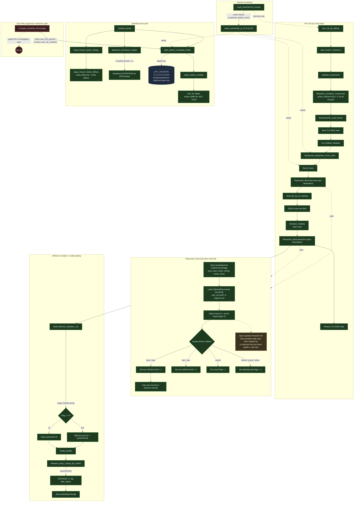

# Decompiled Flow

A consolidated mermaid view of what we know about Mewgenics' cat-loading, defect-display, and breeding-time defect-application pipelines, drawn from Directions 29–48.

The diagram uses readable names. The map at the bottom resolves each readable name to the underlying `FUN_xxxxxxxx` symbol or data address from `findings/binary_function_map.md`.

Legend: green = confirmed in the binary, red = ruled out / no-op for the unresolved defect cases, yellow = open question, blue = data table.

## Readable name → low-level symbol map

### Session bootstrap
| Readable name | Symbol / address |
|---|---|
| Load_SaveFileCat_Context | `FUN_140230750` (`glaiel::MewSaveFile::Load(__int64, SaveFileCat&)`) |
| Seed_xoshiro256_at_TLS+0x178 | TLS slot `+0x178`, seeded from SQLite `properties.random_seed` |

### Per-cat lazy load chain
| Readable name | Symbol |
|---|---|
| Get_Cat_By_DBKey | `FUN_1400d5600` (`get_cat_by_db_key`) |
| CatData_Constructor | `FUN_14005dd60` |
| BodyPart_Container_Constructor | `FUN_14005dfd0` |
| MewSaveFile_Load_Roster | `FUN_14022dfb0` (`glaiel::MewSaveFile::Load(__int64, CatData&)`) |
| Cat_Default_Initializer | `FUN_1400b5260` |
| Randomize_BodyParts_From_GON | `FUN_140732750` |
| Reroll_Voice | `FUN_140733100` (`glaiel::CatVisuals::reroll_voice(Gender)`) |
| Placement_Reconstruction | `FUN_140734760` |
| Serialize_CatData | `FUN_14022d360` (`glaiel::SerializeCatData`) |

### Placement_Reconstruction internals
| Readable name | Symbol / resource |
|---|---|
| CatHeadPlacements MovieClip | `DefineSprite` `char_id=11007` in `game-files/resources/gpak-video/swfs/catparts.swf` |
| Anchor strings | `"leye"`, `"reye"`, `"lear"`, `"rear"`, `"mouth"`, `"ahead"`, `"aneck"`, `"aface"` |

### Effective-mutation / tooltip display
| Readable name | Symbol |
|---|---|
| Build_Effective_Mutation_List | `FUN_1400c9810` |
| Tooltip_Builder | `FUN_1400e38c0` |
| Mutation_Entry_Lookup_By_PartID | `FUN_1407b1190` |

### Breeding-time path
| Readable name | Symbol |
|---|---|
| CatData_Breed | `FUN_1400a6790` (`glaiel::CatData::breed`) |
| Read_Parent_Defect_Strings | `FUN_1400c17f0` (calls `FUN_1400c1600`) |
| Apply_Parent_Defect_Effects | `FUN_1400c1ac0` |
| BodyPart_Inheritance_Helper | `FUN_1400a5390` |
| Birth_Defect_Candidate_Roller | `FUN_1400ca4a0` |
| Apply_Defect_Lambda | `FUN_1400caa20` (`CatData::MutatePiece(...)::lambda_1`) |
| Part_ID_Writer | `FUN_1400cb130` |
| Birth-defect candidate table | `_DAT_141130700` (entries: 0, 1, 2, 3, 3, 3, 3, 3, 8, 8) |

### Save-file progression milestone path
| Readable name | Symbol |
|---|---|
| Compute_SaveFile_Percentage | `FUN_1401d2ff0` (`GlobalProgressionData::ComputeSaveFilePercentage`) |

### Save serializer building blocks (referenced from Serialize_CatData)
| Readable name | Symbol |
|---|---|
| BodyPart_Container_Serializer | `FUN_14022ce10` (writes 73 u32s; calls per-part serializer 14×) |
| Per_BodyPart_Serializer | `FUN_14022cd00` (writes 5 u32s — does NOT serialize `+0x18`) |
| Stat_Record_Serializer | `FUN_14022cf90` (`stat_base`, `stat_mod`, `stat_sec`) |
| Variable_List_Serializer | `FUN_14022d100` |
| Equipment_Slot_Serializer | `FUN_14022b1f0` |
| Generic_ByteVector_Serializer | `FUN_1402345e0` (`CatData+0x8`) |

## Key invariants to remember

- `CatPart+0x18` is the runtime "present" flag. It is **not** serialized (Direction 33). It is written to `1` by the container constructor for all 19 parts, then selectively cleared/set by `Placement_Reconstruction`.
- The display chain has **no fallback path**: a defect tooltip is only shown when `0xFFFFFFFE` is substituted, which requires `CatPart+0x18 == 0`.
- `Birth_Defect_Candidate_Roller` covers only body/head/tail/rear-legs/front-legs categories (per `_DAT_141130700`). It cannot produce eye/eyebrow/ear defects, which is why Whommie's eye/eyebrow defects and Bud's ear defect must come from a different mechanism — currently believed to be `Placement_Reconstruction`.
- The save-file progression milestone path is gated off in the investigation save (`save_file_percent=80 < next_cat_mutation=90`) and could not have produced the unresolved defects regardless.
