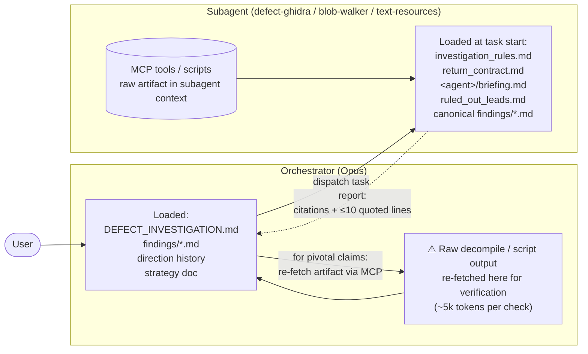
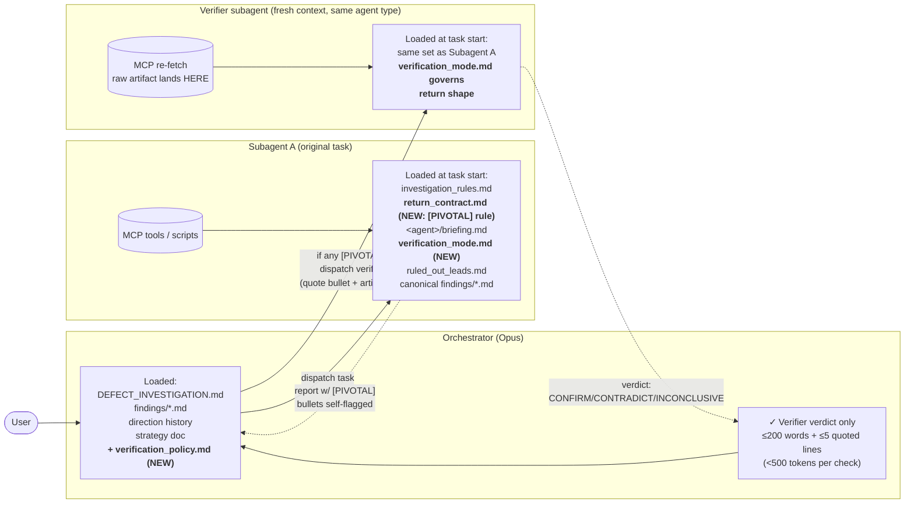

# Plan: Delegated verification for pivotal subagent claims

## Context

In Direction 50, a `defect-ghidra` Sonnet subagent reported a finding that
flipped Direction 47's central conclusion (`FUN_140734760` writes
`CatPart+0xC`, not `+0x18`). Per the orchestrator's existing strategy doc
("for findings that drive direction changes, read the actual artifact"),
Opus verified by re-fetching the decompile via MCP — which works, but
bloats Opus's context with raw decompile output that's only needed to
validate one specific claim.

Goal: keep risky / direction-changing subagent claims verifiable while
keeping Opus's context small. Push verification onto a fresh subagent
whose context absorbs the raw artifact; Opus reads only a compact verdict.

The current investigation tooling already enforces an evidence discipline
(`_shared/investigation_rules.md` §2: identity claims need ≥2 independent
lines) and a uniform report shape (`_shared/return_contract.md`). The
gap is contextual significance: a confidently-presented, well-evidenced
finding can still be wrong about a load-bearing detail (Direction 47/50).
The orchestrator needs a cheap, context-frugal way to second-source those
specific claims.

## Approach

Three coordinated edits, all inside `defect-investigation/`. The user's
local `/home/claude/.claude/commands/advisor-strategy.md` is outside this
repo and is **not** edited here — instead, the orchestrator-facing
verification policy is added in-repo as a discoverable shared doc so the
strategy file just needs a one-line reference (user makes that change
locally, out-of-band).

### Context flow: before vs. after

The point of this change is moving where raw artifacts (decompiles,
script output, GON dumps) accumulate when a pivotal claim is being
double-checked. Diagrams use subgraphs to show what each agent loads
into its own context. Solid arrows are dispatch / file reads; dashed
arrows are reports flowing back.

**Before — verification puts raw artifact into Opus's context.**

**After — verification dispatches a fresh subagent; raw artifact stays
in the verifier's context, not Opus's.**

Two structural shifts visible in the diagrams:

1. The dashed return arrow into Opus changes shape — from "≤10 quoted
   lines + a re-fetched raw artifact" to "≤200 word verdict + ≤5 quoted
   lines." Opus's context absorbs roughly an order of magnitude less per
   pivotal claim.
2. A new context box (Verifier) appears, which exists only as long as
   the verifier task runs. Its raw-artifact load is bounded and ejected
   at task end — it never accumulates across the investigation the way
   Opus's context does.

The verifier role is **not** a new subagent type — it reuses the
existing three (`defect-ghidra`, `defect-blob-walker`,
`defect-text-resources`) with a verification-shaped prompt. The new
`verification_mode.md` tells any of them how to behave when the prompt
has that shape.

### Per-agent worst-case context load

Token counts from `defect-investigation/TOKENS_USED.md`. CLAUDE.md and the
MEMORY system load are excluded (not in that table; apply only to the
orchestrator). Sums are pre-load before any task-specific tool output
(decompile, scripts, grep results) accumulates.

**Orchestrator (Opus).** Investigation context worst case, with all
findings on-demand reads expanded:

| File | Tokens |
|---|---|
| `defect-investigation/AGENTS.md` | 0.4k |
| `DEFECT_INVESTIGATION.md` | 3.5k |
| `findings/AGENTS.md` | 0.2k |
| `_shared/verification_policy.md` (NEW) | 0.5k |
| `findings/binary_function_map.md` | 1.3k |
| `findings/blob_corridor_map.md` | 0.7k |
| `findings/parser_and_gon_reference.md` | 0.8k |
| `findings/ruled_out_leads.md` | 0.9k |
| `findings/OBSOLETE.md` | 0.2k |
| **Sum** | **~8.5k** |

**`defect-ghidra` — primary task mode.** Per `.claude/agents/defect-ghidra.md`
read-order, plus the new shared doc:

| File | Tokens |
|---|---|
| `_shared/investigation_rules.md` | 0.4k |
| `_shared/return_contract.md` (post-edit) | 0.4k |
| `_shared/verification_mode.md` (NEW) | 0.4k |
| `ghidra/briefing.md` | 0.4k |
| `findings/ruled_out_leads.md` | 0.9k |
| `findings/binary_function_map.md` | 1.3k |
| **Sum** | **~3.8k** |

**`defect-ghidra` — verification mode.** Same agent, same read-order — the
load is identical to primary mode. The savings come from the verifier's
*output* (≤200 words + ≤5 quoted lines) landing in Opus's context, not
from a smaller verifier load.

| File | Tokens |
|---|---|
| (same as primary mode) | ~3.8k |
| **Sum** | **~3.8k** |

**`defect-blob-walker`.** Per `.claude/agents/defect-blob-walker.md`,
plus the new shared doc:

| File | Tokens |
|---|---|
| `_shared/investigation_rules.md` | 0.4k |
| `_shared/return_contract.md` | 0.4k |
| `_shared/verification_mode.md` (NEW) | 0.4k |
| `blob-walker/briefing.md` | 0.5k |
| `findings/ruled_out_leads.md` | 0.9k |
| `findings/blob_corridor_map.md` | 0.7k |
| `findings/parser_and_gon_reference.md` | 0.8k |
| `scripts/common.py` | 3.0k |
| **Sum** | **~7.1k** |

**`defect-text-resources`.** Per `.claude/agents/defect-text-resources.md`,
plus the new shared doc:

| File | Tokens |
|---|---|
| `_shared/investigation_rules.md` | 0.4k |
| `_shared/return_contract.md` | 0.4k |
| `_shared/verification_mode.md` (NEW) | 0.4k |
| `text-resources/briefing.md` | 0.3k |
| `findings/parser_and_gon_reference.md` | 0.8k |
| **Sum** | **~2.3k** |

**Per pivotal-claim round-trip cost into Opus's context (the metric this
plan optimizes):**

- Before: ~5–7k (raw `FUN_140734760`-sized decompile re-fetched into Opus)
- After: <0.5k (verifier verdict ≤200 words + ≤5 quoted lines)

Verifier pre-load (~3.8k for ghidra) is paid in the verifier's sandbox, not
Opus's, and ejected at task end.

### 1. `[PIVOTAL]` self-flag in the return contract

**File:** `defect-investigation/subagents/_shared/return_contract.md`

Under the existing **Evidence** section, add a short block:

> **Pivotal-claim flag.** Prefix any individual finding bullet with
> `[PIVOTAL]` if it contradicts a stable claim in any `findings/*.md`
> document you read at task start (the exact set varies by subagent
> type, but always includes the canonical naming/structure references
> for your role). Routine confirmations of existing findings stay
> unmarked. False positives are acceptable; false negatives are the
> failure mode to avoid — when in doubt, flag.

Subagents flag against documents they already load. They are
**not** asked to read `DEFECT_INVESTIGATION.md` — direction history and
active-hypothesis context stay isolated from subagents by design (so
they don't anchor on the orchestrator's current theory or drift into
proposing directions, which `investigation_rules.md` and
`return_contract.md` already forbid).

The "this would change a Direction" case is handled by the orchestrator
retroactively — see the policy doc in §3 below. Split of
responsibilities:

| Flagger | Flags against | Has visibility of |
|---|---|---|
| Subagent (self-flag) | `findings/*.md` it loaded | The stable factual record |
| Orchestrator (retro-flag) | logged Directions, active working model | The investigation's evolving state |

This split means subagents need no new reads to participate.

### 2. Shared "Verification mode" addendum

**New file:** `defect-investigation/subagents/_shared/verification_mode.md`

Defines how any of the three subagents behaves when dispatched as a
verifier. Content:

- **Trigger shape:** the dispatch prompt names a single specific claim
  (verbatim quote), the artifact it concerns (function/offset/address/
  GON path/file:line), and asks for a verdict.
- **Behavior in verification mode:**
  - Do **not** synthesize new directions, propose follow-ups, or surface
    unrelated findings.
  - Re-derive the cited result independently using the same tool that
    produced it (re-decompile, re-run script, re-grep corpus). Do not
    trust the original report's quoted lines — fetch them yourself.
  - Compare your reading to the verbatim claim. State agreement or
    disagreement *at the specific level of detail in the claim*
    (offset, line, value).
- **Return shape (overrides the standard contract):**
  - **Verdict:** one of `CONFIRM` / `CONTRADICT` / `INCONCLUSIVE`.
  - **Evidence:** ≤5 lines quoted verbatim from the artifact, with
    address / file:line citations.
  - **Disagreement (if any):** "Original claim: `<X>`. My reading: `<Y>`.
    Specific divergence at `<where>`." Skip if `CONFIRM`.
  - **Total length cap:** 200 words excluding the ≤5 quoted lines.
  - Omit Method/Confidence/Open follow-ups/Artifacts sections — the
    return contract's normal shape is intentionally bypassed in this mode
    to keep verifier output minimal.
- **Out of scope in verification mode:** do not extend the
  investigation. If your re-derivation surfaces an obviously-related
  question, drop it (or surface it as a one-line note after the
  disagreement block, plain text, no "follow-up directions").

### 3. Orchestrator-facing verification policy

**New file:** `defect-investigation/subagents/_shared/verification_policy.md`

Aimed at Opus / the orchestrator. Content:

- **Retroactive `[PIVOTAL]` flagging.** Subagents flag against the
  `findings/*.md` set they read. The orchestrator must additionally
  flag `[PIVOTAL]` itself when a non-flagged bullet would (a) close,
  open, or invalidate a Direction, or (b) contradict the active working
  model in `DEFECT_INVESTIGATION.md`. This is the orchestrator's job
  because subagents cannot see direction history.
- **When to dispatch a verifier:** any subagent report containing one or
  more `[PIVOTAL]` bullets — whether self-flagged or retro-flagged.
  Multiple `[PIVOTAL]` bullets in one report may be batched into a
  single verifier dispatch if they concern the same artifact; otherwise
  dispatch separately so each verdict is independent.
- **What NOT to do before dispatching:** do not read the raw decompile,
  the raw script output, or the raw GON file into your own context. The
  whole point is to keep that material in the verifier's context, not
  Opus's.
- **Verifier dispatch shape:** quote the `[PIVOTAL]` bullet verbatim,
  name the artifact, point at the verification-mode briefing
  (`_shared/verification_mode.md`), and require the verdict format from
  that doc.
- **Choice of verifier subagent type:** match the artifact source —
  Ghidra claim → `defect-ghidra`; blob-scan claim → `defect-blob-walker`;
  GON/corpus claim → `defect-text-resources`. A different subagent
  *instance* of the same type is fine — the goal is fresh context, not a
  different toolset.
- **Acting on the verdict:**
  - `CONFIRM` → integrate the original finding normally.
  - `CONTRADICT` → do not integrate. Either (a) read the artifact
    yourself (last resort, costs context), or (b) dispatch a third
    verifier with the disagreement quoted as input.
  - `INCONCLUSIVE` → treat as `CONTRADICT` for safety; same options.
- **Audit trail:** when integrating a `[PIVOTAL]` finding into
  `DEFECT_INVESTIGATION.md` or a `findings/` doc, append a short note —
  `Verified by <subagent>: CONFIRM (verdict-summary).` — so future
  readers see the second-source check happened. Verdict text is small
  enough to inline; no separate audit file is required.

### 4. Wire the new docs into agent system prompts and indexes

- **`.claude/agents/defect-ghidra.md`**, **`defect-blob-walker.md`**,
  **`defect-text-resources.md`**: add `_shared/verification_mode.md` to
  each "Before starting any task, read in this order" list (one new
  bullet, slot it after `return_contract.md`).
- **`defect-investigation/subagents/AGENTS.md`**: extend the `_shared/`
  row description to mention the two new files, and add a brief note
  that verification mode is a prompt-shape, not a separate subagent type.
- **`defect-investigation/DEFECT_INVESTIGATION.md`** Multi-Agent Workflow
  section (around line 7-19): add one line pointing at
  `subagents/_shared/verification_policy.md` for the pivotal-claim
  verification flow. No structural change to the workflow table.

## Critical files

Modified:

- `defect-investigation/subagents/_shared/return_contract.md` — add
  `[PIVOTAL]` flag rule under **Evidence**.
- `defect-investigation/subagents/AGENTS.md` — index update.
- `defect-investigation/DEFECT_INVESTIGATION.md` — one-line policy
  reference.
- `.claude/agents/defect-ghidra.md`,
  `.claude/agents/defect-blob-walker.md`,
  `.claude/agents/defect-text-resources.md` — add the new shared doc to
  the read-order list in each.

Created:

- `defect-investigation/subagents/_shared/verification_mode.md` —
  subagent behavior in verification mode.
- `defect-investigation/subagents/_shared/verification_policy.md` —
  orchestrator behavior when handling `[PIVOTAL]` claims.

## Existing patterns reused

- `_shared/investigation_rules.md` §2 (≥2-evidence rule for identity
  claims) — verifier inherits this when re-deriving; no restatement
  needed.
- `_shared/return_contract.md` shape — verification mode explicitly
  *overrides* it with a tighter shape, but the override is documented
  alongside the original so the relationship is visible.
- `ghidra/briefing.md` "Cite + quote ≤10 lines, do not paste full
  decompiles" — verification mode tightens this to ≤5 lines, same
  spirit.

## Out of scope (intentional)

- **Editing the user's local `advisor-strategy.md`.** It lives outside
  the repo. This plan keeps all changes in-repo. The user adds a
  one-line reference from their local strategy doc to
  `subagents/_shared/verification_policy.md` separately.
- **Writing raw decompile excerpts to `audit/raw/`** for verifiers to
  read off disk. The MCP re-fetch by the verifier already lands in the
  verifier's context (not Opus's), so the disk-cache adds tool-permission
  scope without saving Opus tokens. Reconsider only if verifier dispatch
  rate gets high enough that re-fetch latency matters.
- **A dedicated `defect-ghidra-verify` subagent type.** Same toolset and
  briefing, just a different prompt shape — no need to fork the agent
  definition. Reconsider if verification-mode behavior diverges enough
  from the normal briefing to warrant separate system prompts.

## Verification

End-to-end exercise of the workflow change. No application code is
touched, so this is a docs/process change — verification is by dry-run.

1. **Self-flag dry run.** Manually craft a prompt to `defect-ghidra`
   that asks it to verify a known-correct existing claim (e.g.
   "`FUN_14005dfd0` writes byte=1 at `CatPart+0x18` for all 19
   CatParts" from `binary_function_map.md`). Confirm:
   - It reads the new `verification_mode.md` (visible in its read
     order).
   - It returns the tight verdict shape, not the full contract.
   - Total response is under 200 words plus ≤5 quoted lines.

2. **Pivotal-flag self-tagging dry run.** Dispatch a normal
   (non-verification) `defect-ghidra` task whose finding would
   contradict an entry in `binary_function_map.md` (e.g. "What does
   `FUN_140734760` write — `CatPart+0xC` or `CatPart+0x18`?"). Confirm
   the report prefixes the contradicting bullet with `[PIVOTAL]`.

3. **Orchestrator routing dry run.** Take the report from step 2,
   simulate the orchestrator path: confirm `verification_policy.md`'s
   "match artifact source → subagent type" rule unambiguously selects
   `defect-ghidra` for that bullet, and that the dispatch shape
   described in the policy is enough to brief a fresh agent with no
   prior context.

4. **Context-cost check.** Sum the verifier's verdict + 5 quoted lines
   for step 1 and confirm it lands well under the ~5000-token cost of
   reading a full `FUN_140734760`-sized decompile into Opus's context.
   Target: <500 tokens of orchestrator context per pivotal claim.

If any step fails, the failure mode points at a specific doc (read order
not loaded → agent system prompt; format wrong → `verification_mode.md`;
dispatch ambiguous → `verification_policy.md`).
